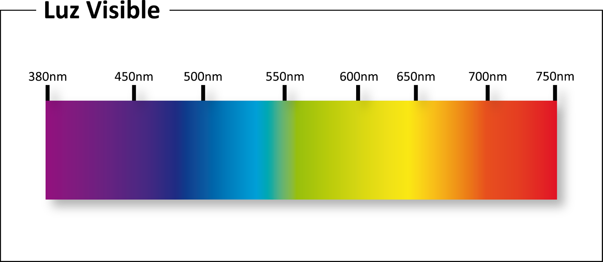

<!-- $theme: gaia -->

# Unidad 01

## Fundamentos del Diseño Web

---

# Composición 

---

La composición es el planeamiento, la colocación o el arreglo de elementos o de ingredientes en un trabajo de arte, o la selección y la colocación de elementos del diseño según principios del diseño dentro del trabajo.

Contribuye a una **respuesta del espectador**; la obra de arte se considera dentro de lo estético (que satisface al ojo), si los elementos dentro del trabajo se ordenan en una composición equilibrada (Dunstan, 1979).

---

## Composición = Organizar

--- 

## Debemos tener en cuenta:

* Cada cerebro hace su propia interpretación de la realidad
* Las diferencias culturales afectan al modo en que se percibe la información.

---

A la hora de diseñar interfaces tendremos en cuenta las dos posibilidades:

1. Qué tipo de estímulos son interpretados de forma similar por todos.
2. Qué tipo de realidad es interpretada de forma diferente por distintos grupos.

---

  Ejemplo
   
  

 
--- 

# Elementos básicos Diseño Web 

---

## Color

--- 

El color es una propiedad que tienen los objetos y que podemos percibir gracias a la luz. Se trata de una onda electromagnética cuyo espectro *visible* al ojo humano va desde el violeta al rojo.

---

Cuando se reflejan todos los colores del espectro estamos viendo el color **blanco**.

Cuando absorve todos los colores vemos el **negro**. 

--- 

## Propiedades de los colores

* Tono (**hue**): Diferencia los colores
* Saturación (**saturation**) : Intensidad o pureza del color (cantidad de luz).
* Luminosidad (**brightness**) : Cantidad de Luz que *refleja* un color.

---

## Círculo cromático

---

---

## Eligiendo Colores

---

  Mondrian: Composicion II en Rojo, Azul y Amarillo

