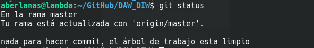
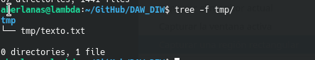
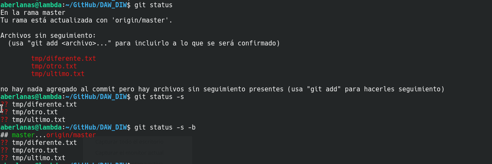
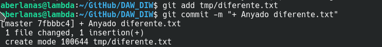
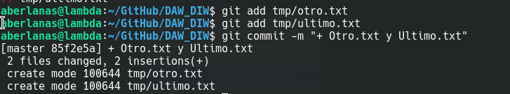

# Tarea: GitHub - Uso Esencial

Vamos a practicar un poco los comandos más habituales que se utilizan en Git.

https://medium.com/@m.monroyc22/mi-gu%C3%ADa-git-313f22568a11

## Prerequisitos

Partimos de que tenemos un repositorio creado para el módulo y de que comenzaremos con todo actualizado en nuestras máquinas respectivas.

>**NOTA**
>Una vez tenemos creado el repositorio en GitHub, debemos descargarlo a nuestra máquina con un 
>`git-clone URL`
>lo que nos generará en el directorio donde estamos la carpeta que corresponde a nuestro repositorio.
>Una vez clonado, debemos entrar en la carpeta y ejecutar los comandos que vienen en la práctica.

Es decir: 


`git status` 

desde raiz de nuestro repositorio ha de mostrar un mensaje como este:


\

Una vez tengamos esto...procedamos...

## Creación de los ficheros

Comenzaremos por crear una carpeta en nuestro repositorio:

`tmp` 

Y dentro creamos un fichero que se llame : `texto.txt` tal y como aparece en la imagen siguiente:


\

El contenido del fichero ha de ser:

`
Texto Plano
`

Una vez realizado esto, añadir mediante :

`git add` 

La carpeta y el fichero, y realizar un commit con el comentario: "*Temporales frescos*"

utilizando :

`git commit `

Una vez realizado el commit, si todo ha ido bien, al ejecutar el comando de `status` nos deberia mostrar un mensaje indicando que nos encontramos 1 commit por delante de nuestro *Origin*.

Vamos a crear unos pocos archivos más...

```bash
cd tmp
echo "Esto en otro archivo" > otro.txt
echo "Esto en otro diferente" > diferente.txt
echo "Y esto ultimo en otro" > ultimo.txt
```

Si ahora ejecutamos los comandos de status...


\

Podemos añadir 1 fichero solo al commit...


\


o varios...



\


Una vez añadidos...si realizamos un `git push`
y los modificamos posteriormente podemos ver mediante el uso del comando:

`git diff`

podremos ver cuales han sido los cambios que se han realizado en los ficheros, esto es especialmente útil...^_^.

### Ejercicio 01

Realiza cambios en los ficheros creados, y muestra las diferencias utilizando `git diff`.

Redirige la salida a un fichero y subélo a tu repositorio cómo:

`UD01/Tareas_UsoDeGitEsencial_Ejercicio01.diff`


## Ramas

Aquí teneis una explicación más exahustiva de lo que es una rama en GIT:

https://git-scm.com/book/es/v2/Ramificaciones-en-Git-%C2%BFQu%C3%A9-es-una-rama%3F


De forma resumida los comandos son:

Crear una Rama:

`git branch "NombreRama"`

Cambiar de rama:

`git checkout -b "NombreRama"`

Ver las diferencias:

`git diff "NombreRama" master`

Realizar un *merge*

* `git checkout master`
* (Desde master): `git merge "NombreRama"`


### Ejercicio 02

Creación de ramas.

Realiza una rama nueva que se llame:

`Feature-CambioNombres`

Cambia a esa rama, cambia la extension de todos los ficheros que acaben en .txt a .dat en tmp/, sube los cambios a la rama, realiza un diff, cambia a la rama master y haz un merge.

Muestra el log de lo que ha ocurrido.

Redirige el log a un fichero y súbelo al repositorio:

```bash
git log --all --decorate --oneline --graph > \
UD01/Tareas_UsoDeGitEsencial_Ejercicio02.log`

```

Avisa al profesor para que lo vea.


## git push

Una diferencia respecto a otros controles de versiones  que no son distribuidos es que git cuenta con la posibilidad de no enviar los cambios a un repositorio "exterior". Es decir tenemos dos repositorios:

**local** y **remote**

Cuando ejecutamos `git push` se *empujan* los cambios del repositorio local al repositorio remoto que tengamos configurado.

Esto es importante hacerlo antes de irnos a casa, o antes de cambiar de puesto de trabajo.


\


### Ejercicio 03

Subir todos los cambios a vuestro repositorio de GitHub y avisad al profesor.


### Ejercicio 04 

Instalar una herramienta de control de versiones en vuestro ordenador de casa (ya sea GitHub desktop o lo que necesiteis) y adjuntar una captura de pantalla de que lo habeis realizado y sincronizado con vuestros repositorios del módulo. 


