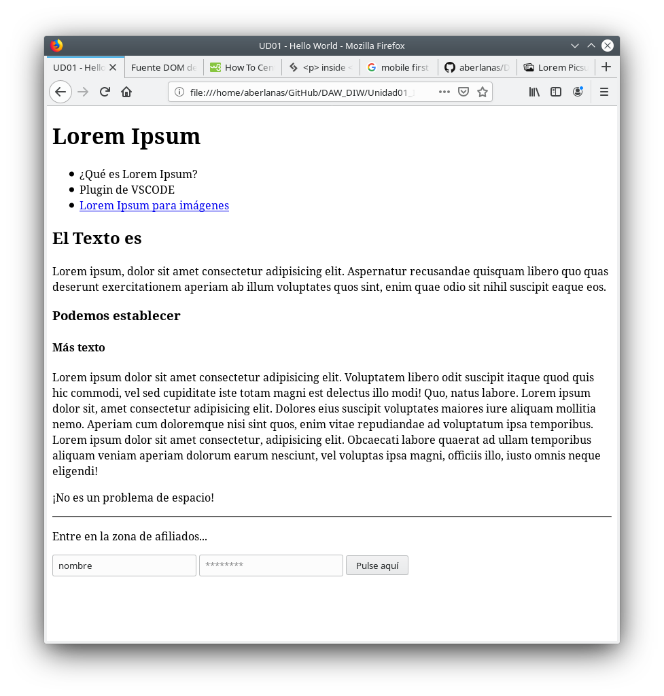

# Tarea: HTML

Vamos a hacer una serie de ejercicios para refrescar un poco el HTML que ya conocemos.

## Ejercicio 01

Crea el HTML que *renderizado* muestre esta página:


\

No se pueden utilizar estilos, ni nada, solo elementos HTML.

Súbelo a tu repositorio con el nombre:

`UD01/Tarea_HTML_Lorem_v1.html`


## Ejercicio 02

Sin usar CSS, tan solo mediante HTML. Haz los cambios necesarios para solventar el problema que hemos visto en clase. (no valen etiquetas `<style>`)

Súbelo a tu repositorio con el nombre:

`UD01/Tarea_HTML_Lorem_v2.html`

## Ejercicio 03

Utilizando etiquetas style, elimina la decoración de los enlaces de la parte de navegación.

Súbelo a tu repositorio con el nombre:

`UD01/Tarea_HTML_Lorem_v3.html`

## Ejercicio 04

Añade un `<article>` con el siguiente texto:

```bash
La página web picsum, nos permite obtener de manera sencilla imágenes para nuestras maquetas y diseños de forma dinámica y profesional.

EXPLICA AQUI COMO FUNCIONA LA URL. PONIENDO UN EJEMPLO DE IMAGEN (AL MENOS).

```

Súbelo a tu repositorio con el nombre:

`UD01/Tarea_HTML_Lorem_v4.html`

## Ejercicio 05

Sirvelo desde tu ordenador del aula y avisa al profesor para que lo compruebe (puedes usar simpleServer.py).

Comprueba tu IP.

