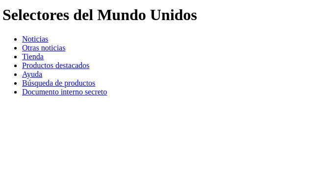
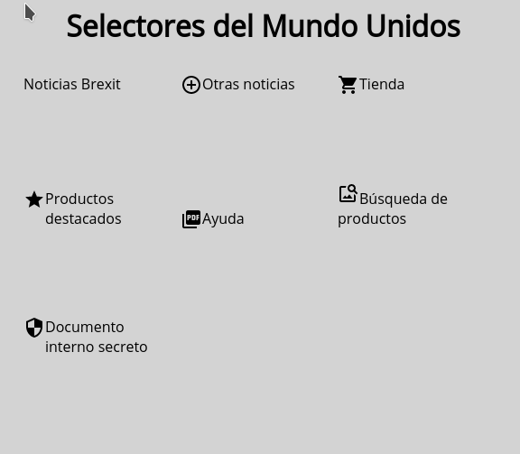

# Tarea: Selectores CSS - 01

Vamos a ir practicando los selectores CSS

## Ejercicio 01

En tu repositorio, crea una carpeta que se llame: `UD02` y dentro de ella la carpeta `Practicas` y copia el fichero de `Tarea_02_Selectores_01.html` que hay en el Moodle.

Rellena el CSS para que el resultado final sea el de la imágen.

Se valorará el uso de *Selectores* y *Variables*.

### Antes

\

### Después

\