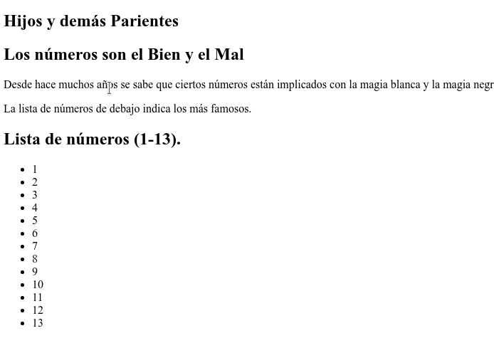
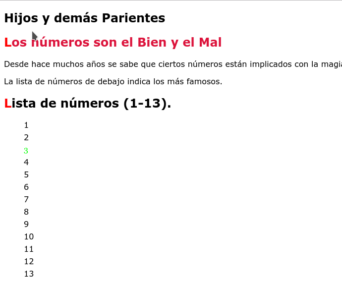

# Tarea: Selectores CSS - 02

Vamos a ir practicando los selectores CSS

## Ejercicio 01

En tu repositorio, crea una carpeta que se llame: `UD02` y dentro de ella la carpeta `Practicas` y copia el fichero de `Tarea_03_Selectores_01.html` que hay en el Moodle.

Rellena el CSS para que el resultado final sea el de la imágen.

Debido a que hay interactividad, os la muestro en clase, pero por si acaso, repito aquí las acciones:

* Al pasar el ratón sobre los elementos 2,4,6,8,10,12 aparece el texto : "Alabado sea el Monstruo Espagetti Volador" a la derecha del elemento.
* Al pasar el ratón sobre los elementos 1,3,5,7,9,11,13 aparece el texto: "Satán !" a la izquierda del elemento, pero sigue alineado por la izquierda con el resto de elementos.

Se valorará el uso de *Selectores* y *Variables*.

### Antes

\

### Después

\