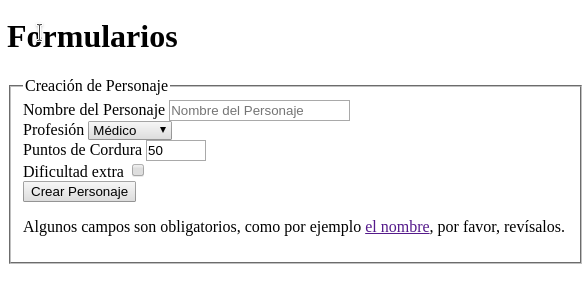
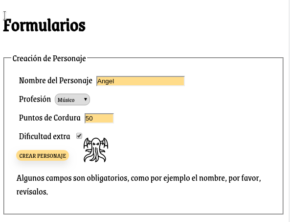

# Tarea: Selectores CSS - 04

Seguimos practicando CSS

## Ejercicio 01

En tu repositorio, crea una carpeta que se llame: `UD02` y dentro de ella la carpeta `Practicas` y copia el fichero de `Tarea_04_Selectores_04.html` que hay en el Moodle.

Rellena el CSS para que el resultado final sea el de la imágen.

Debido a que hay interactividad, os la muestro en clase, pero por si acaso, repito aquí las acciones:

* El Nombre del Personaje solo ha de contener Letras(mayúsculas y minúsculas) en caso contrarió cambiará el color del fondo.
* El select de profesión tiene un borde redondeado y la fuente es la misma que la del texto.
* Los puntos de cordura solo pueden ser un número entre el 1 y el 100, si se superara por arriba o por debajo debe cambiar el color de fondo.
* Si se marca el Checkbox de *Dificultad Extra* aparecerá la imágen de Cthulhu al lado con un tamaño de *50px x 50px*;
* El botón de *crear personaje* está en Mayúsculas. Quitarle el borde y añadir una sombra arrojada.
* Podeis utilizar una paleta diferente de colores, siempre que lo pongais como variables del `:root`.
* Cuando se hace click en "*el nombre*" del texto de abajo, el color del campo del texto del nombre ha de cambiar a otro color diferente que no sea los anteriores.

Se valorará el uso de *Selectores* y *Variables*.

### Antes

\

### Después

\