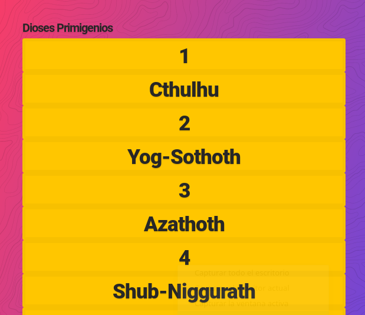
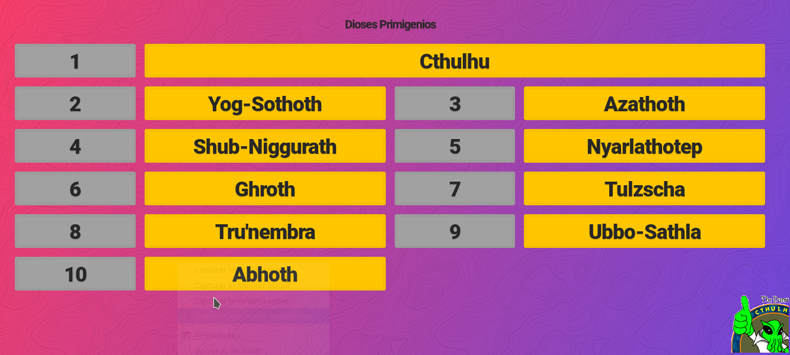

# Tarea: CSS Grid - 1

## Ejercicio 06

En tu repositorio, crea una carpeta que se llame: `UD02` y dentro de ella la carpeta `Practicas` y copia el fichero de `Tarea_06_CSSGrid_01.html` que hay en el Moodle.

Rellena el CSS para que el resultado final sea el de la imágen.

Utiliza el `display:grid` para resolverlo.

Un comportamiento que tal vez no se aprecie en la imágen es que cuando nos situemos por encima de los números, ha de aparecer un borde de 10px negro alrededor tanto del número como del nombre del Dios Primigenio.

\

Se valorará el uso de *Selectores* y *Variables*.

### Antes

\

### Después

\

