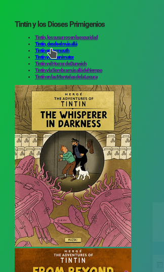
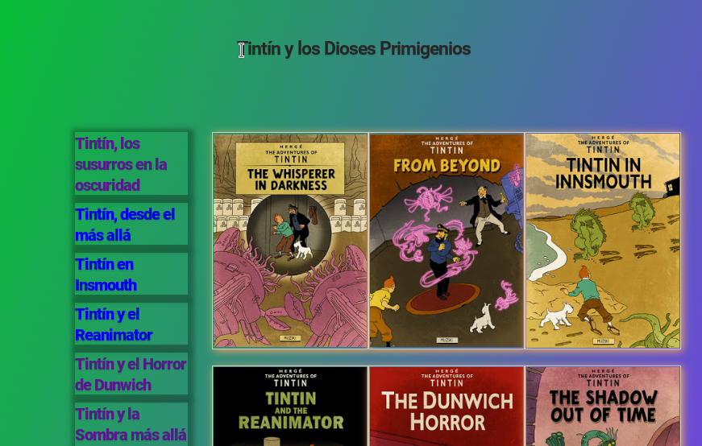

# Tarea: CSS Grid - 1

## Ejercicio 07

En tu repositorio, crea una carpeta que se llame: `UD02` y dentro de ella la carpeta `Practicas` y copia el fichero de `Tarea_07_CSSGrid_02.html` que hay en el Moodle.

Rellena el CSS para que el resultado final sea el de la imágen.

Utiliza el `display:grid` para resolverlo.

Un comportamiento que tal vez no se aprecie es que cuando hacemos click en un enlace de la zona de navegación, debe aplicar un borde verde a la portada que hace referencia.

Se valorará el uso de *Selectores* y *Variables*.

### Antes

\

### Después

\

