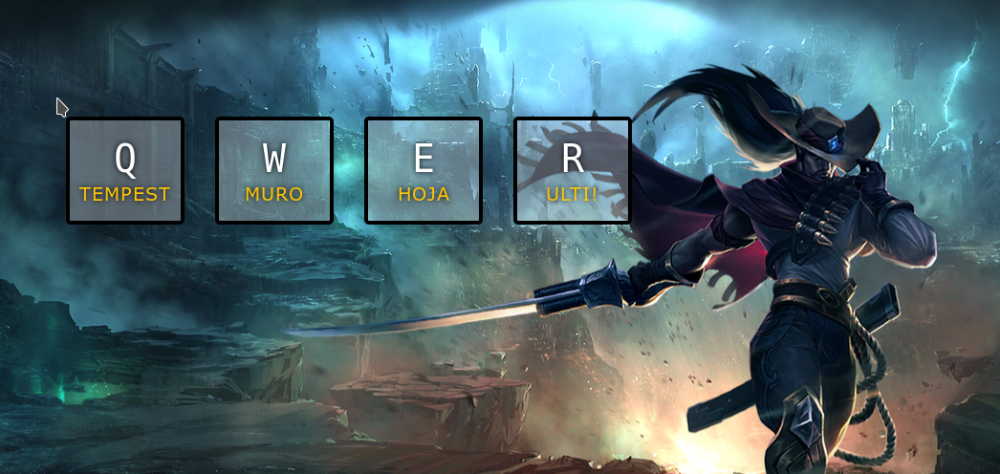

# Tarea: Los Tambores de Yasuo

Realizar un drumkit eligiendo otro personaje del League Of Legends.

Cuando se pulsen las teclas asociadas a las habilidades ha de sonar el sonido que suena en el juego.

## Ejercicio 09

En tu repositorio, crea una carpeta que se llame: `UD02` y dentro de ella la carpeta `Practicas` y copia el fichero de `Tarea_09_Drumkit.html` que hay en el Moodle.

Rellena el `CSS` y el `JS` para que el resultado final sea el de la imágen.

### Después

\

